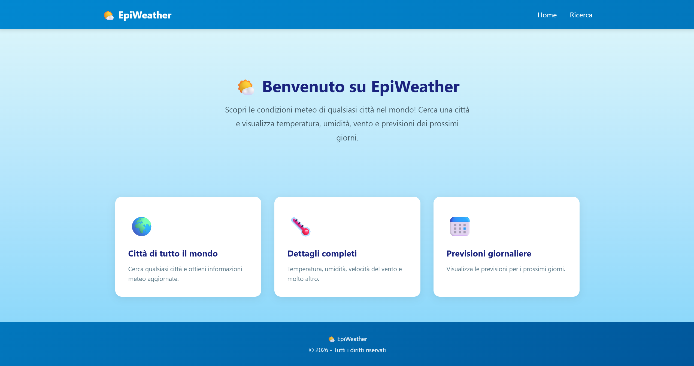
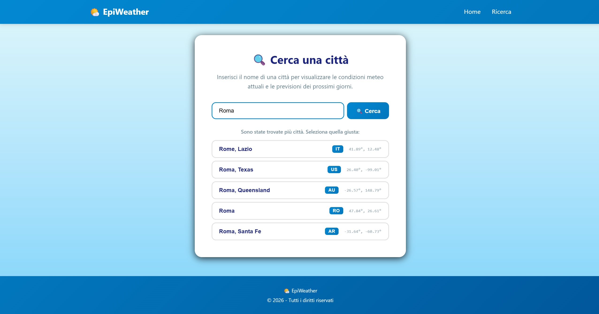
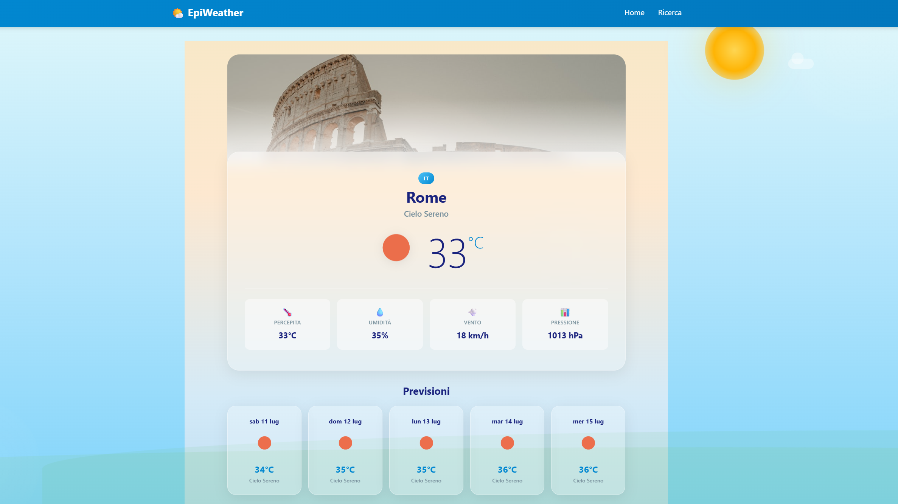

# 🌤️ EpiWeather

**EpiWeather** è una web app meteo sviluppata con **React + Vite**. Permette di cercare una città nel mondo, selezionare la località corretta quando esistono omonimie e visualizzare una dashboard meteo completa con dati attuali, previsioni e artwork dinamico.

---

## 📌 Indice

- [🌤️ EpiWeather](#️-epiweather)
  - [📌 Indice](#-indice)
  - [✨ Funzionalità principali](#-funzionalità-principali)
    - [🏠 Home page](#-home-page)
    - [🔍 Ricerca città](#-ricerca-città)
    - [🌦️ Pagina dettaglio meteo](#️-pagina-dettaglio-meteo)
    - [🖼️ Artwork città dinamico](#️-artwork-città-dinamico)
    - [🧭 Geocoding per località precise](#-geocoding-per-località-precise)
  - [🖼️ Preview](#️-preview)
    - [Home page](#home-page)
    - [Search page](#search-page)
    - [Detail dashboard](#detail-dashboard)
  - [🛠️ Tecnologie usate](#️-tecnologie-usate)
  - [🌍 API usate](#-api-usate)
    - [OpenWeatherMap](#openweathermap)
    - [Unsplash](#unsplash)
  - [📁 Struttura del progetto](#-struttura-del-progetto)
  - [🚀 Setup locale](#-setup-locale)
  - [🔐 Variabili ambiente](#-variabili-ambiente)
  - [📜 Script disponibili](#-script-disponibili)
  - [🧩 Snippet significativi](#-snippet-significativi)
    - [Ricerca città con Geocoding API](#ricerca-città-con-geocoding-api)
    - [Navigazione alla pagina dettaglio con coordinate](#navigazione-alla-pagina-dettaglio-con-coordinate)
    - [Classi meteo dinamiche](#classi-meteo-dinamiche)
    - [Fetch immagine città da Unsplash](#fetch-immagine-città-da-unsplash)
  - [🧪 Testing](#-testing)
  - [📱 Responsive design](#-responsive-design)
  - [✅ Stato progetto](#-stato-progetto)
  - [👨‍💻 Autore](#-autore)

---

## ✨ Funzionalità principali

### 🏠 Home page

La Home introduce l’applicazione e presenta le funzionalità principali tramite tre card:

- ricerca meteo per città di tutto il mondo;
- dettagli meteo completi;
- previsioni giornaliere.

### 🔍 Ricerca città

La pagina di ricerca consente all’utente di inserire una città e avviare la ricerca tramite pulsante.

La ricerca **non parte onChange**, ma solo al submit del form.

Funzionalità incluse:

- input controllato con `useState`;
- validazione campo vuoto;
- caricamento durante la ricerca;
- uso della **OpenWeather Geocoding API**;
- lista di suggerimenti se esistono più città con lo stesso nome;
- navigazione alla pagina dettaglio tramite `useNavigate`.

Esempio pratico:

- cercando `Rome`, l’app può mostrare più risultati;
- l’utente seleziona la città corretta;
- la pagina dettaglio riceve coordinate `lat` e `lon`, evitando errori di localizzazione.

### 🌦️ Pagina dettaglio meteo

La pagina dettaglio mostra:

- nome città;
- paese;
- temperatura attuale;
- descrizione meteo;
- temperatura percepita;
- umidità;
- vento;
- pressione;
- previsioni per i prossimi giorni.

La pagina usa classi dinamiche basate sulle condizioni meteo:

- `weather-clear`;
- `weather-clouds`;
- `weather-rain`;
- `weather-snow`;
- `weather-thunderstorm`;
- `weather-mist`;
- `weather-night`.

### 🖼️ Artwork città dinamico

La pagina dettaglio prova a caricare un’immagine landscape della città usando **Unsplash API**.

L’immagine viene mostrata come banner visuale sopra la card meteo, con overlay per mantenere leggibilità e coerenza grafica.

### 🧭 Geocoding per località precise

La ricerca usa la Geocoding API per ottenere coordinate precise e country code.

Questo evita problemi tipici delle query solo testuali, ad esempio città omonime in paesi diversi.

---

## 🖼️ Preview

> Le immagini sotto sono preview illustrative della UI. Se vuoi usare screenshot reali, puoi salvarli nella cartella `docs/screenshots/` e aggiornare i percorsi.

### Home page



### Search page



### Detail dashboard



---

## 🛠️ Tecnologie usate

- **React**
- **Vite**
- **React Router DOM**
- **CSS custom**
- **CSS Grid**
- **Flexbox**
- **CSS variables**
- **Vitest**
- **Testing Library**
- **OpenWeatherMap API**
- **Unsplash API**

---

## 🌍 API usate

### OpenWeatherMap

L’app usa OpenWeatherMap per:

- geocoding città;
- meteo attuale;
- previsioni a 5 giorni.

Endpoint principali:

```txt
https://api.openweathermap.org/geo/1.0/direct
https://api.openweathermap.org/data/2.5/weather
https://api.openweathermap.org/data/2.5/forecast
```

### Unsplash

Unsplash viene usato per cercare un’immagine landscape della città:

```txt
https://api.unsplash.com/search/photos
```

---

## 📁 Struttura del progetto

```txt
src/
├── App.jsx
├── App.css
├── index.css
├── main.jsx
├── components/
│   ├── Footer.jsx
│   ├── Footer.css
│   ├── Navigation.jsx
│   └── Navigation.css
├── pages/
│   ├── Home.jsx
│   ├── Home.css
│   ├── Search.jsx
│   ├── Search.css
│   ├── Detail.jsx
│   └── Detail.css
├── services/
│   └── weatherService.js
└── test/
    ├── setup.js
    ├── Home.test.jsx
    ├── Navbar.test.jsx
    └── Search.test.jsx
```

---

## 🚀 Setup locale

Clona il progetto e installa le dipendenze:

```bash
npm install
```

Avvia il server di sviluppo:

```bash
npm run dev
```

Apri il browser all’indirizzo indicato da Vite, solitamente:

```txt
http://localhost:5173
```

---

## 🔐 Variabili ambiente

Crea un file `.env` nella root del progetto:

```env
VITE_API_KEY=la_tua_openweather_api_key
VITE_UNSPLASH_ACCESS_KEY=la_tua_unsplash_access_key
```

> Nota: con Vite le variabili esposte al frontend devono iniziare con `VITE_`.

Assicurati che `.env` sia incluso nel `.gitignore`.

---

## 📜 Script disponibili

```bash
npm run dev
npm run build
npm run preview
npm run lint
npm test
```

---

## 🧩 Snippet significativi

### Ricerca città con Geocoding API

```js
export const searchCity = async (query) => {
  const response = await fetch(
    `${GEO_URL}/direct?q=${encodeURIComponent(query)}&limit=5&appid=${API_KEY}`
  );

  if (!response.ok) {
    throw new Error("Errore nella ricerca della città");
  }

  const data = await response.json();

  if (!data || data.length === 0) {
    throw new Error(`Città "${query}" non trovata`);
  }

  return data;
};
```

### Navigazione alla pagina dettaglio con coordinate

```js
navigate(
  `/detail/${encodeURIComponent(r.name)}?lat=${r.lat}&lon=${r.lon}&country=${r.country}`
);
```

### Classi meteo dinamiche

```js
const weatherMain = weather.weather[0].main.toLowerCase();
const weatherIcon = weather.weather[0].icon;
const isNight = weatherIcon.includes("n");

let weatherTypeClass = "weather-clear";
if (weatherMain.includes("cloud")) weatherTypeClass = "weather-clouds";
else if (weatherMain.includes("rain")) weatherTypeClass = "weather-rain";

const pageClassName = `detail-page ${weatherTypeClass}${isNight ? " weather-night" : ""}`;
```

### Fetch immagine città da Unsplash

```js
const response = await fetch(
  `https://api.unsplash.com/search/photos?query=${encodeURIComponent(query)}+city+landmark&client_id=${UNSPLASH_KEY}&per_page=1&orientation=landscape`
);
```

---

## 🧪 Testing

Il progetto usa:

- **Vitest**;
- **React Testing Library**;
- **jest-dom**;
- **jsdom**.

Sono presenti test per:

- Navbar;
- Home page;
- Search page.

Esegui i test con:

```bash
npm test
```

Risultato atteso:

```txt
Test Files  3 passed (3)
Tests       7 passed (7)
```

---

## 📱 Responsive design

L’interfaccia è progettata per funzionare su:

- smartphone;
- tablet;
- desktop;
- schermi ampi.

Sono usati:

- `clamp()` per testi e spaziature fluide;
- CSS Grid per card e forecast;
- Flexbox per layout interni;
- breakpoint dedicati;
- `prefers-reduced-motion` per accessibilità.

---

## ✅ Stato progetto

- Rotte dinamiche funzionanti
- Ricerca città con geocoding
- Meteo attuale
- Forecast
- Artwork città con Unsplash
- UI responsive
- Test React/Vite configurati

---

## 👨‍💻 Autore
JusTMeth25 / Lorenzo Melis